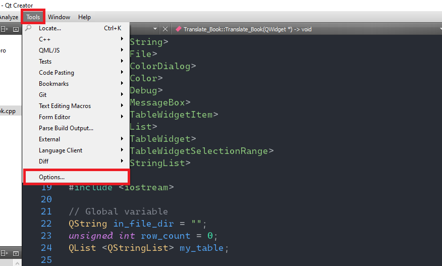
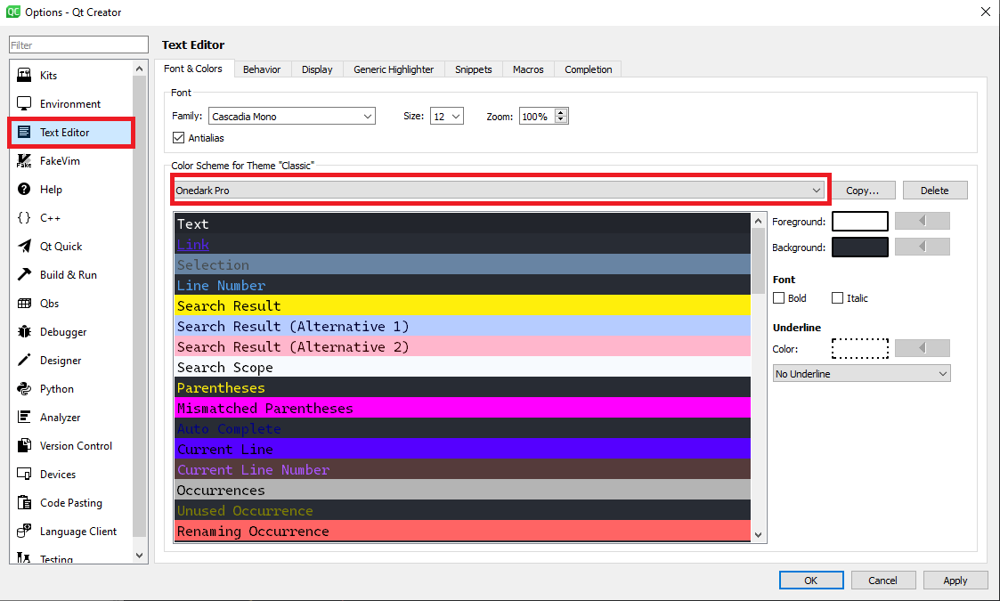
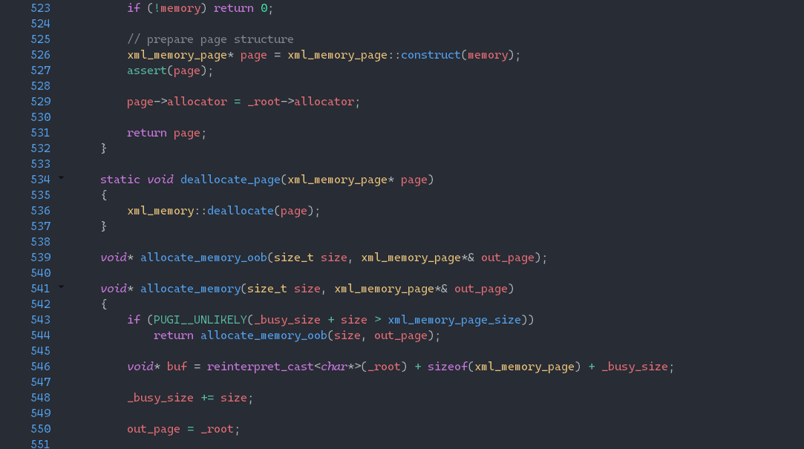
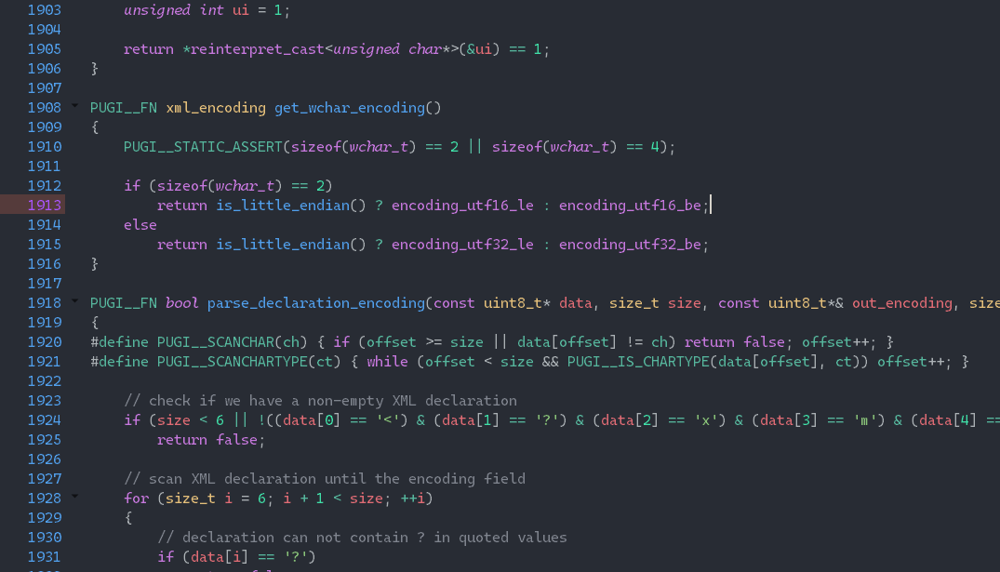

# Qt Creator One Dark Pro theme
## Usage:
1. Download the `.xml` file containing the color scheme.
2. 
    - On Linux/Mac OS: Copy the XML file to `~/.config/QtProject/qtcreator/styles`.
    - On Windows: Copy the XML file to `%APPDATA%\QtProject\qtcreator\styles`
3. Open Qt Creator and navigate to `Tools > Options > Text Editor > Font & Colors` and select your desired color scheme from the drop menu.

## Results:

